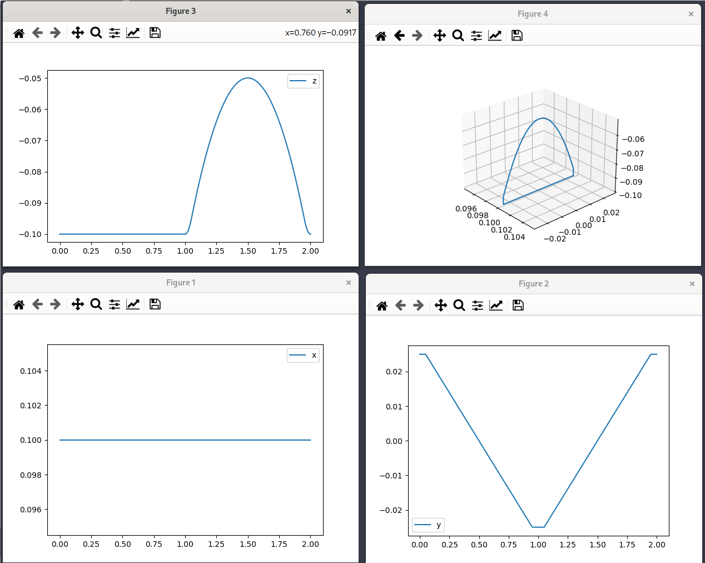
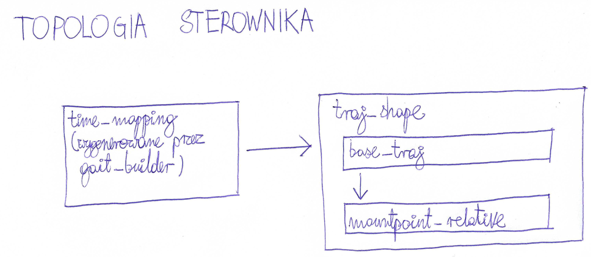

# Advanced Controller

## Generowana trajektoria

Żeby wyeliminować chwianie się heksapoda przy stawianiu nóg
zmieniłem sposób generowania trajektorii w pionie tż. wyeliminować
skoki prędkości. Nowa trajektoria w pionie nie jest fragmentem okręgu
tylko funkcją sklejaną z wielomianów. Ponieważ teraz nogi nie są
podnoszone natychmiastowo, trzeba zatrzymać ruch na chilę, opuścić
pewne nogi, podnieść inne nogi i wznowić ruch.

Chwiania się heksapoda nie udało się wyeliminować. Wydaje się, że
wynika ono ze sposobu w jaki Webots symuluje robota. W symulacji
nogi nie stoją "twardo" na ziemii, tylko "wbijają" się w podłoże.
Kiedy robot dostawia trzy nowe nogi, podłoże bardziej "wypiera" robota.

## Sposób generowania trajektorii

Sterownik pozwala niezależnie sterować:
* Chodem (sekwencją przestawiania nóg)
* Parametrami chodu (rozstaw nód, prędkość, prędkość kątowa robota)
* Ustawieniem korpusu (wysokość zawieszenia, kąty eulera orientacji)

Topologia sterownika odpowiada temu podziałowi.

Na początku generowana jest bazowa trajektoria (względem punktu bazowego).
Później jest stosowana zmiana układu współrzędnych wzg. mountpointu.
W ten sposób generowany jest znormalizowany kształt trajektorii.
Poprzez odpowiednie mapowanie czasu na kształt trajektorii uzyskujemy
różne chody.

## Komunikacja z robotem (/symulacją)

Tutaj nie wprowadzałem żadnych zaawansowanych rozwiązań.
Stworzyłem prowizoryczną klasę MegaLynx, która zapewnia
połączenie z symulacją. Słyszałem, że Piotrek pracuje nad
tym i nie chciałem pisać reduntantego kodu.
